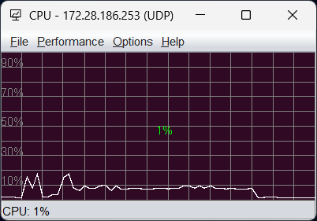

# monitor-con v2.0 — Linux Performance Monitor

A consolidated Linux system monitor that collects CPU, Memory, and Network metrics from `/proc` and serves them over the network. Built entirely in Java — server and GUI client.



## What's in this package

| File | Description |
|------|-------------|
| `jmonitor-server.jar` | Java server — UDP, TCP, HTTP, gRPC (fat JAR) |
| `monitor-server.sh` | Linux/Mac launcher for the server |
| `jmonitor-server.ini` | Server JAVA_HOME config |
| `monitor_client.jar` | Java Swing GUI client — all four transports (fat JAR) |
| `monitor-client.sh` | Linux/Mac launcher for the GUI |
| `monitor-client.bat` | Windows launcher for the GUI |
| `monitor_client.ini` | Client JAVA_HOME config |
| `monitor_resource.xml` | Browser path for help links |

## Transports

| Protocol | Description |
|----------|-------------|
| `udp` | UDP datagrams (fire-and-forget, lowest overhead) |
| `tcp` | TCP stream, newline-delimited JSON |
| `http` | HTTP GET /metrics |
| `grpc` | gRPC with protobuf serialization |

## Quick start — Server (Linux)

Prerequisite: JDK 21+

```bash
./monitor-server.sh -P udp -p 2019 -e
```

If `java` is not on your PATH, set `JAVA_HOME` in `jmonitor-server.ini`.

## Quick start — GUI client

Prerequisite: JDK 21+

```bash
# Linux/macOS
./monitor-client.sh -h <host> -p 2019 -P udp

# Windows
.\monitor-client.bat -h <host> -p 2019 -P udp
```


